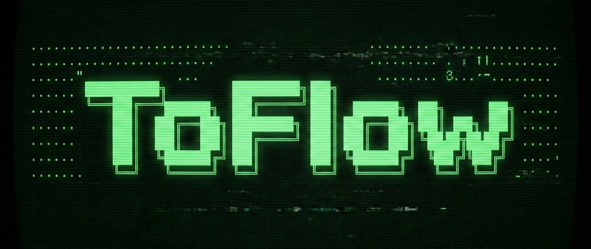
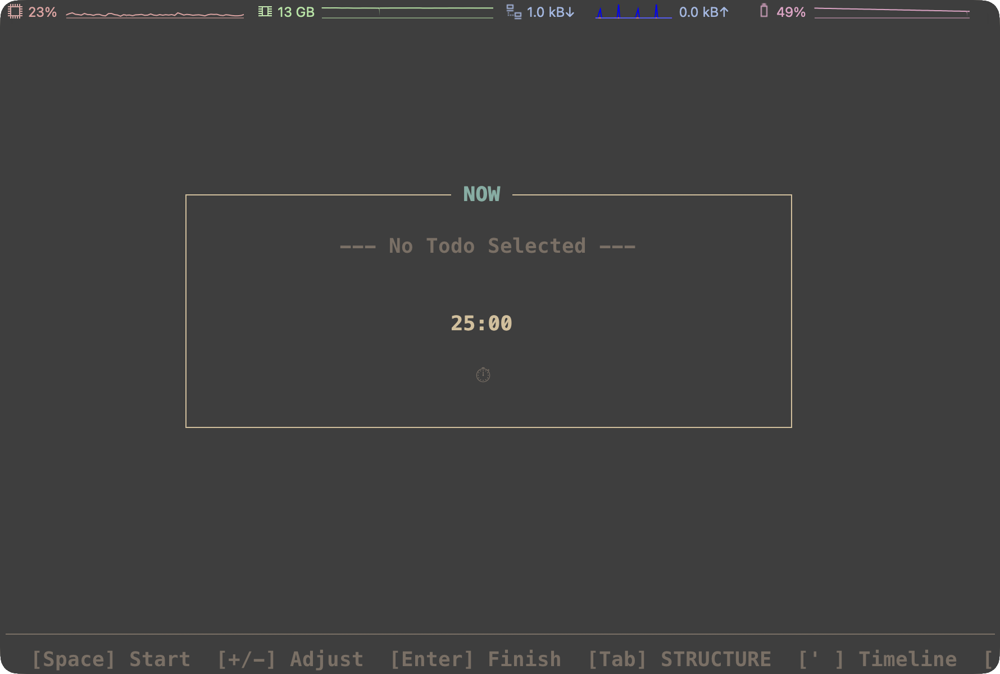

# ToFlow

<div align="center">



**Focus, Action, Growth. All inside your terminal.**

[](https://www.python.org/downloads/)
[](https://github.com/astral-sh/uv)
[](https://opensource.org/licenses/MIT)
[](https://github.com/prompt-toolkit/python-prompt-toolkit)

**English** | [简体中文](./README_zh.md)

---



</div>

## Introduction

**ToFlow** is a **terminal-based productivity system** built around two core concepts: **Project-based Structure** and **Pomodoro Timer**. It helps you manage complex life goals while keeping your daily execution focused and rhythm-based.

*   **Project-based Structure**: Say goodbye to flat lists. With the **Track -> Project -> Todo** hierarchy, every small action belongs to a project and serves a long-term goal.
*   **Pomodoro & Flow**: Use the **Now Mode** (a built-in Pomodoro timer) to block out distractions. Separate "planning" from "doing" to maintain a clear mind and deep focus.
*   **Visualize Growth**: Every focus session is automatically recorded. Use the **Timeline** to review your trajectory and see exactly where your effort goes.

## Core Features

| | |
|---|---|
| 🎯 **Structured Life** | End the chaos. With the Track -> Project -> Todo system, every task has a home. |
| ⏱️ **Flow State** | Built-in "Now" Pomodoro timer. Stress-free starting, immersive execution. |
| 📅 **Timeline Review** | All focus records are saved. Review your history in reverse chronological order and see your growth. |
| ⌨️ **Keyboard Driven** | Built for geeks. Efficient keybindings, millisecond response, total control without leaving the keyboard. |
| 📥 **Inbox Mechanism** | The Box acts as a buffer for Ideas and Todos. Capture now, organize later. |

## Quick Start

ToFlow is built with Python and recommends `uv` for management.

### Installation & Run

```bash
# 1. Clone the repo
git clone https://github.com/mukii/toflow.git
cd toflow

# 2. Install dependencies (using uv)
uv sync

# 3. Run ToFlow
uv run toflow

# 4. Add alias (optional)
echo 'alias toflow="cd [toflow directory] && uv run toflow"' >> [your shell rc file]
source [your shell rc file]
```

*The database will be initialized at `~/.toflow/toflow.db` on first run.*

## Documentation

ToFlow comes with complete documentation to help you master the system.

- **[📖 Philosophy](./docs/PHILOSOPHY.md)**
  <br>Why do we need another Todo App? Deep dive into ToFlow's design philosophy.

- **[🕹️ User Manual](./docs/MANUAL.md)**
  <br>Full cheat sheet for shortcuts, navigation maps, and core workflows.

- **[🛠️ Developer Guide](./docs/DEVELOPER.md)**
  <br>System architecture, data models, and contribution guide.

- **[📝 Changelog](./docs/CHANGELOG.md)**
  <br>Version history and new features.

---

<div align="center">
Made with ❤️ by Mukii

[MIT License](./LICENSE)
</div>
