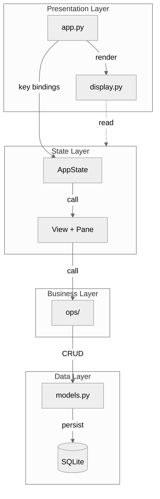

# ToFlow

<div align="center">


**Focus, Action, Growth. All inside your terminal.**

[](https://www.python.org/downloads/)
[](https://github.com/astral-sh/uv)
[](https://opensource.org/licenses/MIT)
[](https://github.com/prompt-toolkit/python-prompt-toolkit)

**English** | [简体中文](./README_cn.md)

---


</div>

## Documentation

*(Docs are in Chinese.)*

|  |  |
|--|--|
| **[User Manual](./docs/MANUAL_cn.md)** | Shortcuts, navigation, TUI & CLI operations |
| **[Developer Guide](./docs/DEVELOP_cn.md)** | Project structure, database, ops, TUI architecture |
| **[Design Doc](./docs/DESIGN_cn.md)** | Item styles, formatter specs |
| **[Changelog](./docs/CHANGELOG_cn.md)** | Version history, including v0.2 architecture refactor |

---

## Philosophy

ToFlow is a **personal system for action and growth**. It's not just about recording "what to do"—it's designed to solve three core problems we often face with multiple projects and complex life directions: **Chaos**, **Decision Paralysis**, and **Lack of Accumulation**.

### 1. Stop the Chaos: Structure Your Life

The "Todos" we need to handle vary wildly. Some are lifelong pursuits (like "Career" or "Health"), some are temporary projects (like "Exam Prep"), and some are just errands like "Picking up a package." If you stuff all of these into a single flat list, you'll only feel overwhelmed because you can't distinguish priority.

**The ToFlow Way: Layers**

ToFlow uses a three-layer structure to house all your thoughts and tasks:

- **Track (Areas of Life)**: The important, indivisible areas of your life, such as "Work," "Health," or "Family." These are the long-term tracks you invest in.
- **Project**: Specific undertakings within a Track that you are currently pushing forward. They have a beginning and an end.
- **Todo (Actions)**: The atomic, clear next steps.

This structure ensures that for every small action, you know which project it belongs to and which life direction it serves. **It's not just categorization; it's awareness.**

### 2. Stop Overthinking: Separate Planning from Doing

When you have dozens of tasks, "what to do next" becomes a huge mental burden. We often waste willpower weighing options and end up procrastinating.

**The ToFlow Way: Separate "Thinking" and "Doing"**

ToFlow designs two distinct modes:

- **Box (Inbox)**: When you are busy and suddenly think "I need to buy milk" or have a new idea, don't let it interrupt you. Throw it into the Box. This is your buffer zone.
- **Now (Focus Mode)**: When you are ready to work, enter Now mode. There are no complex lists here, just a **Pomodoro timer** and the one thing you are doing right now. It follows a minimalist philosophy: **Don't overthink, just start.**

### 3. Visualize Growth: Make Time Visible

In traditional todo lists, tasks disappear once checked off. After a busy year, it often feels like you have nothing to show for it, and you don't know where your time went.

**The ToFlow Way: The Value of Time**

ToFlow believes that finishing an action is not the end.

- **Timeline**: Every focused session you complete is automatically recorded.
- **Review**: Through the Timeline view, you can clearly see where you spent your time.

When you can visually see your sustained investment in a direction, that feedback itself is a huge motivation. **Turn "what you did" into a visible trajectory of growth.**

---

## Core Features

**Structured Life** — Track → Project → Todo hierarchy. Every task has a home.

**Today Queue** — Up to 5 items. Set planned sessions per item, track progress with dots. Press Enter on any Todo in Structure or Box to add it.

**Suggestion** — Smart recommendations by pin, deadline, stage, and recent momentum. One key to add to Today. No more "what next?"

**Focus Mode** — Built-in Now mode, minimalist Pomodoro. Pick one from Today and start. Stress-free, immersive execution.

**Timeline Review** — All focus records auto-saved to Timeline. Every effort traceable.

**Inbox** — Box serves as a buffer for ideas and todos. Capture now, organize later.

**Keyboard Driven** — Efficient shortcuts, millisecond response. Fingers never leave the keyboard.

---

## Quick Start

ToFlow is built with Python. We recommend using `uv`.

```bash
# 1. Clone
git clone https://github.com/mukimasta/toflow.git
cd toflow

# 2. Install dependencies
uv sync

# 3. Run
uv run toflow
```

*The database will be automatically initialized at `~/.toflow/toflow.db` on first run.*

---

## Architecture Overview

ToFlow adopts a **unidirectional layered architecture** where each layer only depends on the layer below, never calling upward.


```mermaid
%%{init: {'theme': 'neutral'}}%%
flowchart TB
    subgraph Presentation [Presentation Layer]
        App[app.py]
        Display[display.py]
    end

    subgraph StateLayer [State Layer]
        AppState[AppState]
        View[View + Pane]
    end

    subgraph Business [Business Layer]
        Ops[ops/]
    end

    subgraph DataLayer [Data Layer]
        Models[models.py]
        DB[(SQLite)]
    end

    App -->|key bindings| AppState
    App -->|render| Display
    Display -.->|read| StateLayer
    AppState -->|call| View
    View -->|call| Ops
    Ops -->|CRUD| Models
    Models -->|persist| DB
```

| Layer | Component | Description |
|:--:|------|------|
| **Presentation** | `app.py` | Key bindings, application entry |
| | `display.py` | Viewport clipping, zen layout, styles |
| **State** | `AppState` | structure_stack, primary, secondary, modal |
| | `View` / `Pane` | View and layout abstraction |
| **Business** | `ops/` | CRUD, query, status, archive, pin, move, etc. |
| **Data** | `models.py` | 5 entity ORM (Track / Project / Todo / Session / NowTodayItem) |
| | `SQLite` | Local persistence `~/.toflow/toflow.db` |

---

<div align="center">

Made with ❤️ by Mukii

[MIT License](./LICENSE)

</div>
