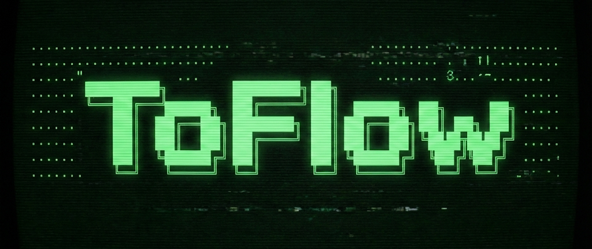
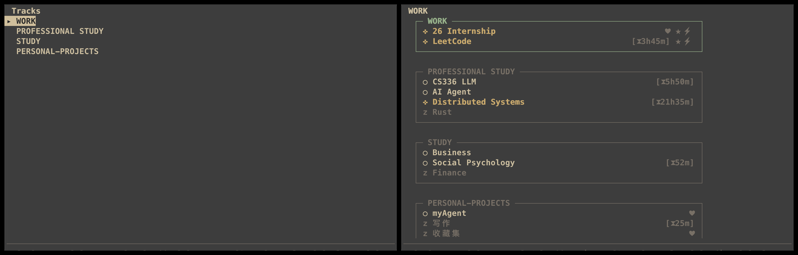
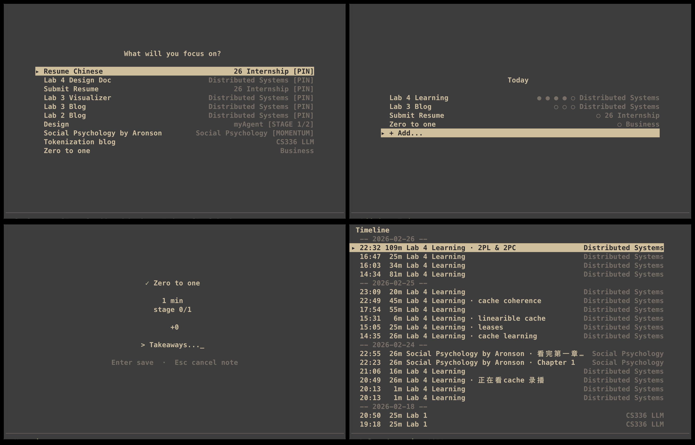
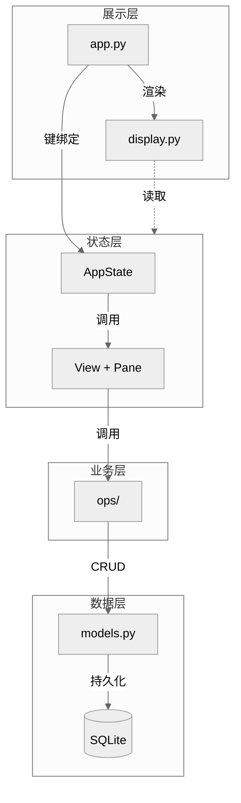

# ToFlow

<div align="center">



**专注、行动、成长。一切都在终端里。**

[English](./README.md) | **简体中文**

[](https://www.python.org/downloads/)
[](https://github.com/astral-sh/uv)
[](https://opensource.org/licenses/MIT)
[](https://github.com/prompt-toolkit/python-prompt-toolkit)

---





</div>

## 文档

|  |  |
|--|--|
| **[用户手册](./docs/MANUAL_cn.md)** | 快捷键、导航、TUI 与 CLI 操作说明 |
| **[开发者指南](./docs/DEVELOP_cn.md)** | 项目结构、数据库、ops、TUI 架构 |
| **[设计文档](./docs/DESIGN_cn.md)** | Item 样式、formatter 规范 |
| **[更新日志](./docs/CHANGELOG_cn.md)** | 版本历史，含 v0.2 架构重构 |

---

## 理念

ToFlow 是一个**个人行动与成长系统**。它不仅仅是记录「要做什么」，而是为了解决我们在多项目并行、生活方向复杂时常遇到的三个核心问题：**混乱**、**选择困难**和**缺乏积累**。

### 1. 对抗混乱：给生活一个清晰的结构

我们要做的所谓 Todo 其实千差万别。有些是一生的长期追求（如「职业发展」），有些是阶段性的攻坚项目（如「考研」），有些只是今天要去拿个快递的琐事。如果把这些都塞进同一个列表，只会让你感到混乱和焦虑，因为你分不清主次。

**ToFlow 的方法：分层管理**

ToFlow 用一个三层结构来安放你所有的想法和任务：

- **Track（长期方向）**：你人生中那些不可分割的重要领域，比如「工作」、「健康」、「家庭」。它们是你要长期投入的轨道。
- **Project（阶段项目）**：在某个轨道下，你正在推进的具体事情。它有开始，也有结束。
- **Todo（具体行动）**：原子化的、清晰的每一步。

这种结构让你在做每一件小事时，都清楚它属于哪个项目，服务于哪个人生方向。**这不仅仅是归类，更是一种觉知。**

### 2. 拒绝纠结：找到当下最值得做的事

当你有几十个待办事项时，「接下来做什么」就成了一个巨大的心理负担。我们往往在反复权衡中消耗了意志力，最后反而选择了逃避。

**ToFlow 的方法：把「想」和「做」分开**

ToFlow 设计了两个截然不同的模式：

- **Box（收集箱）**：当你在忙别的事，突然想到「要买牛奶」或者「有个新点子」，别让它打断你，直接扔进 Box。这里是你的缓冲区。
- **Now（行动器）**：当你准备干活时，进入 Now 模式。这里没有复杂的列表，只有一个**番茄钟**和你当前选定的一件事。它借鉴了极简的设计哲学：**无需纠结，只管开始。**

### 3. 积累复利：让行动产生反馈

传统的待办清单，任务做完勾掉就消失了。忙了一年，感觉两手空空，既不知道时间都去哪了，也没有留下什么经验。

**ToFlow 的方法：看见时间的价值**

ToFlow 认为，行动的结束不是终点。

- **Timeline（时间线）**：你每一次专注的 Session 都会被记录下来。
- **回顾与复盘**：通过时间线视图，你可以清晰地看到自己把时间花在了哪里。

当你能直观地看到自己在某个方向上的持续投入，这种反馈本身就是一种巨大的激励。**让「做过的事情」变成你看得见的成长轨迹。**

---

## 核心功能

**结构化生活** — Track → Project → Todo 三层结构，每个任务都有归属。

**Today 今日队列** — 最多 5 项，可设定每项的计划专注次数，用圆点标记完成进度。从 Structure / Box 的 Todo 按 Enter 即可加入。

**Suggestion 推荐** — 按置顶、截止日期、阶段、近期动量等维度智能推荐，一键加入 Today，无需纠结「接下来做什么」。

**专注模式** — 内置 Now 模式，极简番茄钟。从 Today 选一项开始，轻松进入，沉浸执行。

**时间线回顾** — 专注记录自动保存到 Timeline，让每一次投入可追溯。

**收集箱** — Box 作为灵感与待办的缓冲区。先捕捉，后整理。

**键盘驱动** — 高效快捷键，毫秒响应，手指不离键盘。

---

## 快速开始

ToFlow 使用 Python 构建，推荐使用 `uv`。

```bash
# 1. 克隆
git clone https://github.com/mukimasta/toflow.git
cd toflow

# 2. 安装依赖
uv sync

# 3. 运行
uv run toflow
```

*首次运行会在 `~/.toflow/toflow.db` 自动初始化数据库。*

---

## 架构概览

ToFlow 采用**单向分层架构**，每层只依赖下层，不向上调用。



| 层 | 组件 | 说明 |
|:--:|------|------|
| **展示** | `app.py` | 键绑定、应用入口 |
| | `display.py` | 视口裁剪、zen 布局、样式 |
| **状态** | `AppState` | structure_stack、primary、secondary、modal |
| | `View` / `Pane` | 视图与布局抽象 |
| **业务** | `ops/` | CRUD、query、status、archive、pin、move 等 |
| **数据** | `models.py` | 5 实体 ORM（Track / Project / Todo / Session / NowTodayItem） |
| | `SQLite` | 本地持久化 `~/.toflow/toflow.db` |

---

<div align="center">

Made with ❤️ by Mukii

[MIT License](./LICENSE)

</div>
