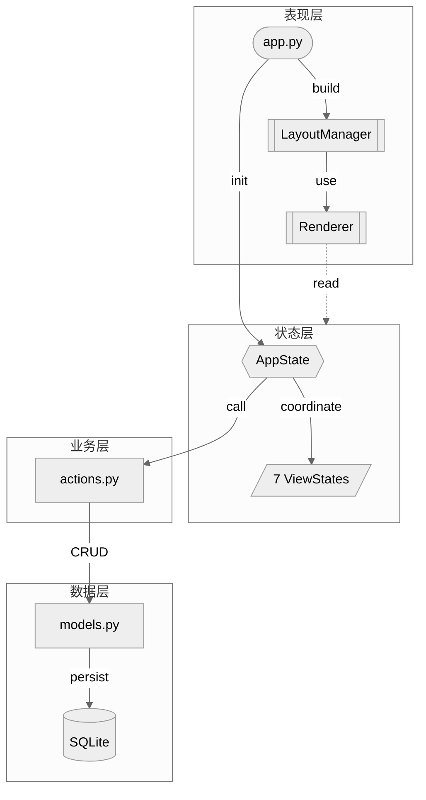

# ToFlow

<div align="center">


**专注，行动，成长。尽在终端之中。**

[](https://www.python.org/downloads/)
[](https://github.com/astral-sh/uv)
[](https://opensource.org/licenses/MIT)
[](https://github.com/prompt-toolkit/python-prompt-toolkit)


[English](./README.md) | **简体中文**

---


</div>

## 文档

|  |  |
|--|--|
| **[📖 理念篇](./docs/PHILOSOPHY_zh.md)** | 为什么需要另一个 Todo App？深入了解 ToFlow 背后的设计哲学。 |
| **[🕹️ 用户手册](./docs/MANUAL_zh.md)** | 完整的快捷键列表、界面导航与核心工作流指南。 |
| **[🛠️ 开发者文档](./docs/DEVELOPER_zh.md)** | 系统架构、数据模型设计与贡献指南。 |
| **[📝 更新日志](./docs/CHANGELOG.md)** | 10+ 版本迭代，包含 3 次重大架构重构。 |

---

## 问题

传统的待办清单是**扁平的**。但真实的人生并不是。

你有多个人生方向（事业、健康、家庭），几十个正在进行的项目，以及成百上千的小任务。当所有东西都堆在一个列表里时，你会面临：

1. **混乱** — 没有结构，没有优先级，无尽地滚动。
2. **决策瘫痪** — "我现在该做什么？"成为每天的折磨。
3. **没有积累** — 任务完成后就消失了。一年后，你不知道时间都去哪了。

ToFlow 就是为解决这些问题而设计的。

---

## 核心特性

**🎯 结构化人生** — 通过 **Track → Project → Todo** 三层体系，让每一项任务都有归属，服务于长期目标。

**⏱️ 心流状态** — 内置 **Now 行动器**，一个极简的番茄钟。无压力地开始，沉浸式地执行。

**📅 时间线回顾** — 所有专注记录自动保存至 **Timeline**，让每一份努力都有迹可循。

**📥 收集箱** — **Box** 作为 Idea 与 Todo 的缓冲区。捕捉灵感，稍后整理。

**⌨️ 全键盘驱动** — 高效键位，毫秒级响应，手指无需离开键盘。

---

## 架构一览

ToFlow 采用**单向分层架构**，每一层只依赖下层，从不反向调用。



**分层职责**

| 层 | 组件 | 说明 |
|:--:|------|------|
| **表现层** | `app.py` | 键位绑定、应用入口 |
| | `LayoutManager` | prompt-toolkit 布局构建 |
| | `Renderer` | 纯渲染，只读状态 |
| **状态层** | `AppState` | 全局协调器 |
| | `7 ViewStates` | Now / Structure / Box / Timeline / Archive / Info / Input |
| **业务层** | `actions.py` | 业务意图封装，Result 模式统一返回 |
| **数据层** | `models.py` | 5 实体 ORM（Track / Project / Todo / Idea / Session） |
| | `SQLite` | 本地持久化 `~/.toflow/toflow.db` |

> 📝 **10+ 版本迭代，3 次重大重构** — 查看 [CHANGELOG](./CHANGELOG.md) 了解完整演进历程。

---

## 快速开始

ToFlow 基于 Python 开发，推荐使用 `uv` 进行构建和运行。

```bash
# 1. 克隆仓库
git clone https://github.com/mukimasta/toflow.git
cd toflow

# 2. 安装依赖
uv sync

# 3. 运行
uv run toflow

# 4. 添加 alias（可选）
echo 'alias toflow="cd /path/to/toflow && uv run toflow"' >> ~/.zshrc
source ~/.zshrc
```

*首次运行会自动初始化数据库于 `~/.toflow/toflow.db`*

---

<div align="center">

Made with ❤️ by Mukii

[MIT License](./LICENSE)

</div>
