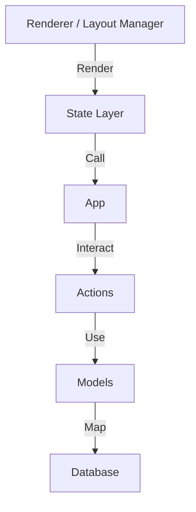

# 工程实现文档

[English](./DEVELOPER.md) | **简体中文**

本文档详细描述了 ToFlow 的系统架构与工程实现细节，旨在帮助开发者深入理解其设计哲学与代码结构。

## 1. 项目结构

```text
.
├── pyproject.toml          # uv environment management (project config)
├── README.md               # README documentation
├── docs/
│   ├── CHANGELOG.md        # CHANGELOG documentation
│   ├── CHANGELOG_zh.md     # CHANGELOG documentation (Chinese)
│   ├── DEVELOPER.md        # Developer guide
│   ├── DEVELOPER_zh.md     # Developer guide (Chinese)
│   ├── MANUAL.md           # User manual
│   ├── MANUAL_zh.md        # User manual (Chinese)
│   ├── PHILOSOPHY.md       # Design philosophy
│   ├── PHILOSOPHY_zh.md    # Design philosophy (Chinese)
│   └── assets/             # Documentation assets
├── main.py                 # Legacy entry point (optional)
├── toflow/
│   ├── __init__.py         # Package init
│   ├── cli.py              # CLI entry point ("toflow" command)
│   ├── actions.py          # Business logic
│   ├── database.py         # Database connection & setup
│   ├── models.py           # SQLAlchemy ORM models
│   └── tui/                # prompt-toolkit Terminal UI Application
│       ├── __init__.py     # TUI package core
│       ├── app.py          # Key bindings, layout, TUI app launcher
│       ├── layout_manager.py    # Dynamic layout computation
│       ├── renderer.py     # Pure rendering routines
│       ├── states/         # State management modules
│       │   ├── app_state.py        # Top-level state coordinator
│       │   ├── input_state.py      # Input MODE state
│       │   ├── now_state.py        # NOW VIEW state
│       │   ├── structure_state.py  # STRUCTURE VIEW state
│       │   ├── info_state.py       # INFO VIEW state
│       │   ├── timeline_state.py   # TIMELINE VIEW state
│       │   ├── archive_state.py    # ARCHIVE VIEW state
│       │   ├── box_state.py        # BOX VIEW state
│       │   └── message_holder.py   # Message/Result manager
```

### 代码风格及规范
自解释，减少不必要的注释，仅在必要时使用英文注释；如无必要不使用缩写，使用全称（例如 `current_project_id` 而不是 `cur_proj_id`）。

## 2. 架构设计哲学

### 一、整体架构哲学：单向分层，依赖递减



**核心原则**：每一层只依赖下层，从不反向调用。

## 3. 数据库设计

SQLite 数据库，路径：`~/.toflow/toflow.db`

### 实体定义

**Track**:
*   `id` PRIMARY KEY
*   `name` NOT NULL
*   `description`
*   `status` NOT NULL, DEFAULT 'active' (active / sleeping)
*   `archived`: boolean, DEFAULT FALSE
*   `created_at_utc` NOT NULL
*   `archived_at_utc`
*   `order_index`

**Project**:
*   `id` PRIMARY KEY
*   `track_id` NOT NULL, FOREIGN KEY
*   `name` NOT NULL
*   `description`
*   `deadline_utc`
*   `willingness_hint` (0-3)
*   `importance_hint` (0-3)
*   `urgency_hint` (0-3)
*   `status` NOT NULL, DEFAULT 'active' (active / sleeping / cancelled / finished)
*   `pinned`: boolean, DEFAULT FALSE (Constraint: pinned => status='active')
*   `archived`: boolean, DEFAULT FALSE
*   `created_at_utc` NOT NULL
*   `started_at_utc`
*   `finished_at_utc`
*   `archived_at_utc`
*   `order_index`

**TodoItem** (Structure Todo / Box Todo):
*   `id` PRIMARY KEY
*   `project_id` FOREIGN KEY (nullable, NULL means Box Todo)
*   `name` NOT NULL
*   `description`
*   `url`
*   `deadline_utc`
*   `status` NOT NULL, DEFAULT 'active' (active / done / sleeping / cancelled)
*   `total_stages`: int, DEFAULT 1
*   `current_stage`: int, DEFAULT 0
*   `pinned`: boolean, DEFAULT FALSE (Constraint: pinned => status='active')
*   `archived`: boolean, DEFAULT FALSE
*   `created_at_utc` NOT NULL
*   `completed_at_utc`
*   `archived_at_utc`
*   `order_index`

**IdeaItem**:
*   `id` PRIMARY KEY
*   `name` NOT NULL
*   `description`
*   `maturity_hint` (0-3)
*   `willingness_hint` (0-3)
*   `status` NOT NULL, DEFAULT 'active' (active / sleeping / deprecated / promoted)
*   `archived`: boolean, DEFAULT FALSE
*   `created_at_utc` NOT NULL
*   `archived_at_utc`
*   `promoted_at_utc`
*   `promoted_to_project_id` FOREIGN KEY (nullable)
*   `order_index`

**NowSession**: (Now Action Session)
*   `id` PRIMARY KEY
*   `description`
*   `project_id` FOREIGN KEY (nullable)
*   `todo_item_id` FOREIGN KEY (nullable)
*   `duration_minutes` NOT NULL
*   `started_at_utc` NOT NULL
*   `ended_at_utc` (NULL means saving on-going session)
*   Constraint: Only one of `project_id` or `todo_item_id` should be provided.

## 4. 环境与依赖

*   **环境管理**: 使用 `uv` 进行依赖管理。
*   **核心依赖**: `typer` (CLI), `prompt-toolkit` (TUI), `sqlalchemy` (ORM)。
