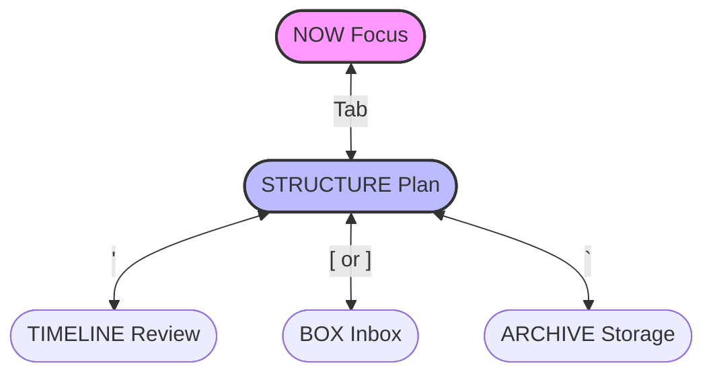

# User Manual

**[English](./MANUAL.md)** | [简体中文](./MANUAL_zh.md)

## Interface Navigation

ToFlow's interface is designed around distinct **Views**, each serving a specific phase of your workflow.

### 1. Core Views (The "Do" Loop)

These are your primary workspaces. Switch between them instantly with <kbd>Tab</kbd>.

*   **STRUCTURE View (Planning)**
    The backbone of your system. Manage your Tracks, Projects, and Todos hierarchically. Navigate deeply through levels (Track -> Project -> Todo) to add, edit, move, and organize tasks. This is where you decide *what* to work on.

*   **NOW View (Focusing)**
    Your execution environment. A distraction-free timer for the single task you've chosen. Displays the current focused task and a Pomodoro-style timer, recording your "Sessions" (blocks of focused work) and handling work/break cycles.

### 2. Secondary Views (Input & Review)

Auxiliary views for capturing inputs and reviewing outputs.

*   **BOX View (Inbox, press `[` or `]`)**
    A holding ground for incoming thoughts.
    *   **Box Todos**: One-off tasks or things to be sorted later. Can be moved into Projects.
    *   **Box Ideas**: Potential future projects. Can be promoted to full Projects within a Track.

*   **TIMELINE View (Review, press `'`)**
    A chronological log of your effort. Shows a history of all completed Sessions, grouped by day. Useful for daily reviews to see where your time went.

### 3. Utility Views

*   **ARCHIVE View (Storage, press `` ` ``)**
    Access completed or shelved items. A read-only view of archived Tracks, Projects, Todos, and Ideas. Allows unarchiving items if you need to reactivate them.

*   **INFO View (Details, press `i`)**
    Detailed inspection. A read-only panel showing all properties of the selected item (e.g., creation dates, full descriptions, IDs).

## Keyboard Shortcuts

ToFlow is designed for full keyboard control.

### Global Navigation

| Key | Action | Description |
| :--- | :--- | :--- |
| <kbd>Tab</kbd> | Switch View | Toggle between **NOW** and **STRUCTURE** |
| <kbd>'</kbd> | Timeline | Open/Close **Timeline** view |
| <kbd>[</kbd> | Box (Todos) | Open Box for Todos (tasks) |
| <kbd>]</kbd> | Box (Ideas) | Open Box for Ideas |
| <kbd>`</kbd> | Archive | Open/Close **Archive** view |
| <kbd>Esc</kbd> / <kbd>q</kbd> | Exit/Back | Close current overlay view |
| <kbd>Ctrl+c</kbd> | Quit | Force quit the application |

### Structure View (Planning)

| Key | Action | Description |
| :--- | :--- | :--- |
| <kbd>↓</kbd> | Down | Select next item |
| <kbd>↑</kbd> | Up | Select previous item |
| <kbd>←</kbd> | Back | Go up a level (Todo -> Project -> Track) |
| <kbd>→</kbd> | Enter | Go down a level (Track -> Project -> Todo) |
| <kbd>Enter</kbd> | **Focus** | Select current task and switch to **Now View** to start |
| <kbd>Space</kbd> | Toggle Status | Mark as Done / Undo |
| <kbd>Alt+Up/Down</kbd> | Reorder | Move current item up/down |
| <kbd>+</kbd> / <kbd>=</kbd> | Add | Add new Track/Project/Todo at current position |
| <kbd>r</kbd> | Rename | Edit current item content |
| <kbd>Backspace</kbd> | Delete | Delete current item (requires confirmation) |
| <kbd>a</kbd> | Archive | Move current item to Archive |
| <kbd>s</kbd> | Sleep | Mark current item as Sleep (Paused) |
| <kbd>c</kbd> | Cancel | Mark current item as Cancelled |
| <kbd>p</kbd> | Pin | Pin current item to top |
| <kbd>i</kbd> | Info | View detailed information |

### Now View (Focus)

| Key | Action | Description |
| :--- | :--- | :--- |
| <kbd>Space</kbd> | **Start / Pause** | Start or pause the timer |
| <kbd>Enter</kbd> | **Finish Session** | Complete current session and log the result |
| <kbd>r</kbd> | Reset | Reset the current timer |
| <kbd>+</kbd> / <kbd>=</kbd> | Add Time | Extend countdown (+5 mins) |
| <kbd>-</kbd> | Reduce Time | Shorten countdown (-5 mins) |
| <kbd>i</kbd> | Info | View current task details |

## Workflow Guide

### Scenario 1: Morning Planning

1.  Open `toflow`. It starts in **STRUCTURE** view by default.
2.  Browse your `Tracks` and `Projects` to decide today's direction.
3.  Press <kbd>[</kbd> to open **Box** and check tasks collected yesterday.
4.  Select important Box Todos and press <kbd>m</kbd> to move them into specific Projects.
5.  Planning complete. Ready to work.

### Scenario 2: Deep Work

1.  In **STRUCTURE** view, select the Project or Todo you want to tackle.
2.  Press <kbd>Enter</kbd> (or <kbd>Tab</kbd>) to switch to **NOW** view.
3.  Confirm the current task is correct.
4.  Press <kbd>Space</kbd> to **start the timer**. Enter flow state.
5.  (Optional) If a distracting thought occurs, press <kbd>]</kbd> to quickly log it in Box (Ideas), then <kbd>Esc</kbd> to return to Now. **Focus unbroken.**
6.  Work done. Press <kbd>Enter</kbd> to finish the Session and record a note.

### Scenario 3: Catching Ideas

*Wherever you are:*
1.  A great idea strikes.
2.  Press <kbd>]</kbd> to open Box (Ideas).
3.  Press <kbd>+/=</kbd> to type the idea and Enter to save.
4.  Press <kbd>Esc</kbd> to close Box and return to where you were.
