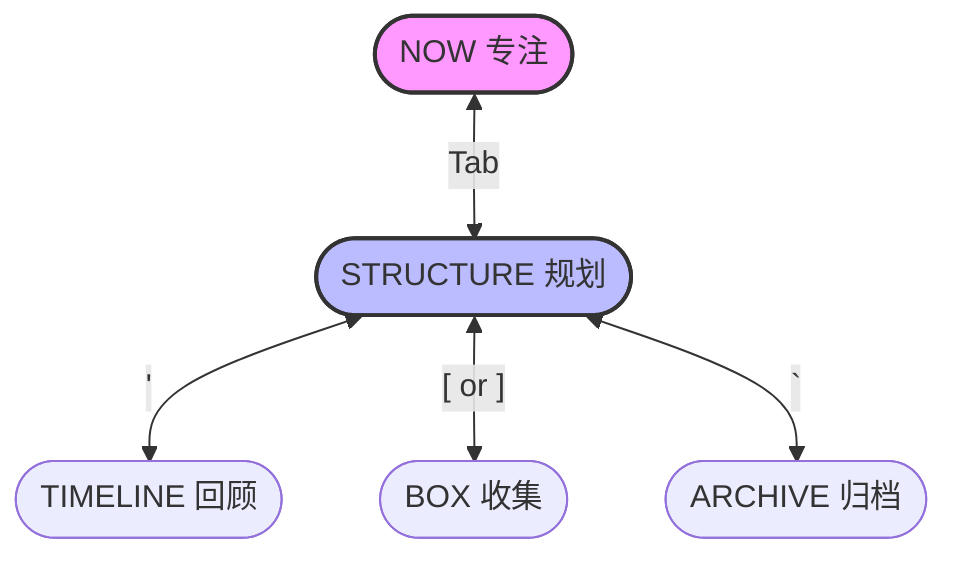

# 用户手册

[English](./MANUAL.md) | **简体中文**

## 界面导航

ToFlow 的界面设计围绕着不同的 **View (视图)** 展开，每个视图服务于工作流的不同阶段。

### 1. 核心视图 (行动循环)

这是你日常最主要的工作区，通过 <kbd>Tab</kbd> 快速切换。

*   **STRUCTURE View (规划视图)**
    系统的骨架。以层级结构管理你的 Track (轨道)、Project (项目) 和 Todo (行动)。支持深度的层级导航 (Track -> Project -> Todo)，在这里进行任务的新增、编辑、移动和整理。这是你决定“要做什么”的地方。

*   **NOW View (专注视图)**
    你的执行环境。一个纯净的、无干扰的计时器，专注于你当前选定的唯一任务。显示当前正在进行的任务和番茄钟倒计时，自动记录你的 "Sessions" (专注时段)，并处理工作/休息循环。

### 2. 辅助视图 (输入与回顾)

用于捕捉灵感和回顾成果的辅助视图。

*   **BOX View (收集箱，按 `[` 或 `]` 进入)**
    思维的缓冲区。
    *   **Box Todos**：一次性的杂事，或者还没想好归属的任务。稍后可以移动 (Move) 到具体的 Project 中。
    *   **Box Ideas**：潜在的项目灵感。成熟后可以升级 (Promote) 为 Track 中的正式 Project。

*   **TIMELINE View (回顾视图，按 `'` 进入)**
    按时间顺序记录的行动日志。按日期倒序显示所有完成的 Session，用于每日回顾，查看时间都花在了哪里。

### 3. 工具视图

*   **ARCHIVE View (归档视图，按 `` ` `` 进入)**
    存放已完成或暂时搁置的项目。只读视图，查看已归档的 Track、Project、Todo 和 Idea。如果需要重新激活，可以在这里执行解档 (Unarchive) 操作。

*   **INFO View (详情面板，按 `i` 查看)**
    详细信息查看面板。只读，显示当前选中条目的所有属性（如创建时间、完整描述、ID 等数据库底层字段）。

## 快捷键速查表

ToFlow 采用全键盘操作。

### 全局导航 (Global)

| 按键 | 动作 | 说明 |
| :--- | :--- | :--- |
| <kbd>Tab</kbd> | 切换视图 | 在 **NOW** 和 **STRUCTURE** 之间切换 |
| <kbd>'</kbd> | 时间线 | 打开/关闭 **Timeline** 视图 |
| <kbd>[</kbd> | Box (Todos) | 打开 Box 待办收集箱 |
| <kbd>]</kbd> | Box (Ideas) | 打开 Box 灵感收集箱 |
| <kbd>`</kbd> | 归档 | 打开/关闭 **Archive** 视图 |
| <kbd>Esc</kbd> / <kbd>q</kbd> | 退出/返回 | 关闭当前浮层视图 |
| <kbd>Ctrl+c</kbd> | 退出程序 | 强制退出应用 |

### Structure 视图 (规划)

| 按键 | 动作 | 说明 |
| :--- | :--- | :--- |
| <kbd>↓</kbd> | 下移 | 选择下一个项目/任务 |
| <kbd>↑</kbd> | 上移 | 选择上一个项目/任务 |
| <kbd>←</kbd> | 返回 | 返回上一级 (Todo -> Project -> Track) |
| <kbd>→</kbd> | 进入/选择 | 进入下一级 (Track -> Project -> Todo) |
| <kbd>Enter</kbd> | **专注** | 选中当前任务，切换到 **Now 视图** 准备开始 |
| <kbd>Space</kbd> | 标记状态 | 标记为完成 (Done) / 撤销完成 |
| <kbd>Alt+Up/Down</kbd> | 排序 | 上下移动当前条目的顺序 |
| <kbd>+</kbd> / <kbd>=</kbd> | 新增 | 在当前位置新增 Track/Project/Todo |
| <kbd>r</kbd> | 重命名 | 编辑当前条目的内容 |
| <kbd>Backspace</kbd> | 删除 | 删除当前条目 (需要二次确认) |
| <kbd>a</kbd> | 归档 | 将当前条目移入 Archive |
| <kbd>s</kbd> | 睡眠 | 将当前条目标记为 Sleep (暂停) |
| <kbd>c</kbd> | 取消 | 将当前条目标记为 Cancelled (取消) |
| <kbd>p</kbd> | 置顶 | 将当前条目置顶 (Pin) |
| <kbd>i</kbd> | 详情 | 查看详细信息 (Info) |

### Now 视图 (专注)

| 按键 | 动作 | 说明 |
| :--- | :--- | :--- |
| <kbd>Space</kbd> | **开始 / 暂停** | 启动或暂停番茄钟计时 |
| <kbd>Enter</kbd> | **结束会话** | 完成当前专注时段 (Session)，记录成果 |
| <kbd>r</kbd> | 重置 | 重置当前计时器 |
| <kbd>+</kbd> / <kbd>=</kbd> | 增加时间 | 延长当前倒计时 (+5分钟) |
| <kbd>-</kbd> | 减少时间 | 缩短当前倒计时 (-5分钟) |
| <kbd>i</kbd> | 详情 | 查看当前任务详情 |

## 工作流指引

### 场景 1：晨间规划

1.  打开 `toflow`，默认进入 **STRUCTURE** 视图。
2.  浏览 `Track` 和 `Project`，确认今天的主要方向。
3.  按 <kbd>[</kbd> 打开 **Box**，查看昨天临时收集的杂事。
4.  选中重要的 Box Todo，按 <kbd>m</kbd> 将其归类到具体的 Project 中。
5.  规划完毕，准备开始工作。

### 场景 2：深度工作

1.  在 **STRUCTURE** 视图中，选中今天要攻克的 Project 或 Todo。
2.  按 <kbd>Enter</kbd> (或 <kbd>Tab</kbd>) 切换到 **NOW** 视图。
3.  确认显示的当前任务无误。
4.  按 <kbd>Space</kbd> **开始计时**。进入心流状态。
5.  (可选) 如果中途有干扰想法，按 <kbd>]</kbd> 快速记入 Box Idea，然后按 <kbd>Esc</kbd> 迅速回到 Now 继续工作。
6.  工作结束，按 <kbd>Enter</kbd> 完成 Session，记录描述。

### 场景 3：捕捉灵感

*无论你在哪个视图：*
1.  突然想到一个绝佳的点子。
2.  按 <kbd>]</kbd> 打开 Box (Ideas)。
3.  按 <kbd>+/=</kbd> 输入想法，回车保存。
4.  按 <kbd>Esc</kbd> 关闭 Box，回到刚才的地方，**心流未被打断**。
